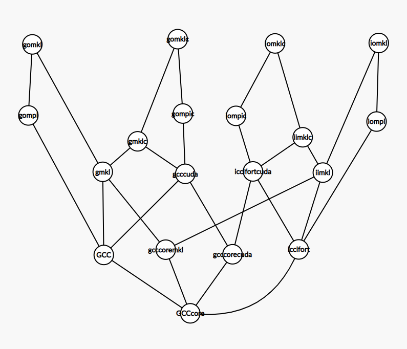
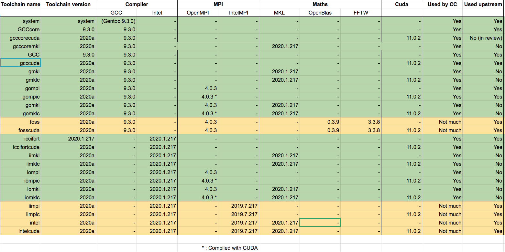

# Installing with EasyBuild

**Home:** [Software management](INDEX.md)

**Note:** Before starting, please make sure that you have followed the generic
steps and the EasyBuild specific steps described in [initial setup](setup.md).

The following contains the essential parts you will need to use EasyBuild on our
infrastructure. For detailed EasyBuild documentation, see:

- [EasyBuild documentation](http://easybuild.readthedocs.io/en/latest)
- [Overview of generic
  EasyBlocks](https://easybuild.readthedocs.io/en/latest/version-specific/generic_easyblocks.html#generic-easyblocks)

### Contents

- [Specificities of EasyBuild on Compute Canada](#specificities-of-easybuild-on-compute-canada)
- [Searching for packages in EasyBuild](#searching-for-packages-in-easybuild)
- [Toolchains](#toolchains)
  - [Background](#background)
  - [Compute Canada toolchains](#compute-canada-toolchains)
    - [Toolchain hierarchy](#toolchain-hierarchy)
    - [Core toolchains](#core-toolchains)
    - [Compiler-only toolchains](#compiler-only-toolchains)
    - [Compiler-only toolchains (Gentoo stack)](#compiler-only-toolchains-gentoo-stack)
    - [Family toolchains](#family-toolchains)
    - [Default Toolchains for StdEnv/2016.4](#default-toolchains-for-stdenv20164)
    - [Default Toolchains for StdEnv/2018.3](#default-toolchains-for-stdenv20183)
    - [Toolchains to use with StdEnv/2020](#toolchains-to-use-with-stdenv2020)
- [Installing a package in EasyBuild](#installing-a-package-in-easybuild)
  - [Installing for a different toolchain](#installing-for-a-different-different-toolchain)
  - [Installing for a different architecture](#installing-for-a-different-architecture)
  - [Installing for a different StdEnv](#installing-for-a-different-stdenv)
  - [Creating or changing a recipe](#creating-or-changing-a-recipe)
  - [Checksums in EasyConfig recipes](#checksums-in-easyconfig-recipes)
- [Tips and tricks, troubleshooting](#tips-and-tricks-troubleshooting)
  - [Rebuilding installed software](#rebuilding-installed-software)
  - [Downloading source or binaries manually](#downloading-source-or-binaries-manually)
  - [Fixing the loader and runpath](#fixing-the-loader-and-runpath)
  - [Dependencies](#dependencies)
  - [Debugging your build](#debugging-your-build)
  - [Nix hardening](#nix-hardening)
  - [Providing the source distribution](#providing-the-source-distribution)
  - [Other topics to be covered in the future](#other-topics-to-be-covered-in-the-future)
- [Contributing back to EasyBuild](#contributing-back-to-easybuild)
- [Installing restricted software](#installing-restricted-software)
  - [Different cases](#different-cases)
  - [Informing users of restrictions at module load time](#informing-users-of-restrictions-at-module-load-time)
  - [Installing the software](#installing-the-software)
  - [Deploying POSIX group-restricted software with CVMFS](#deploying-posix-group-restricted-software-with-cvmfs)
  - [Hiding POSIX group-restricted software on systems that don’t have them](#hiding-posix-group-restricted-software-on-systems-that-dont-have-them)
  - [Existing POSIX groups to manage access to pieces of software](#existing-posix-groups-to-manage-access-to-pieces-of-software)
- [FAQ](#faq)

## Specificities of EasyBuild on Compute Canada

While the vast majority of recipes provided by EasyBuild are reusable or easily
adaptable on Compute Canada, there are a number of specificities that you should
know when using EasyBuild on our software stack.

- **Do not use the `--robot`/`-r` flag when installing a software package.**
  This flag tends to install all of the dependencies, which might not be the
  default versions that we have.
- **Do not use the standard upstream toolchains `intel` and `foss`.**  These
  toolchains use either Intel MPI or OpenBLAS, both of which we don't use much.
  Prefer the toolchains listed in the EasyBuild toolchains section.
- **Do not use `versionsuffix`.** Our module naming scheme discards
  `versionsuffix`. Prefer using `modaltsoftname` to change the name of the
  module, rather than adding a version suffix.
- **Do not rewrite an EasyConfig file unless you absolutely need to.**   Prefer
  using the `--try-toolchain` option. This helps keeping installation
  procedures consistent across toolchains.

## Searching for packages in EasyBuild

You can search for packages (existing, installed or not) using this command:

```
eb -S REGEX
```

For example, `eb -S GROMACS` or `eb -S gromacs` gives a list of easyconfig
(`.eb`) files for GROMACS.

## Toolchains

### Background

Toolchains are a core concept within EasyBuild. A toolchain is a set of
recipes/modules that includes compilers (GCC, Intel, PGI), MPI implementations
(such as OpenMPI), Cuda,  and core mathematical libraries such as MKL.
Toolchains are layered, with more complex toolchains being built out of a
combination of sub-toolchains. Toolchains are installed as modules, but most of
them are hidden by default. You can get a list of toolchains using:

```
module --show_hidden avail
```

and looking for the hidden (`H`) modules. Typically, they will have obscure
names like `iompi`, `gomkl`, etc.  Not all toolchains are hidden. For example,
`iccifort` is associated with the `intel` modules (visible).

To obtain the meaning of the toolchain names, run:

```
eb --list-toolchains
```

**Important:** Toolchains in EasyBuild recipes are case-sensitive, while our
modules are all lowercase. Except `GCCCore`, `GCC`, `PGI`, all toolchain names
are lowercase.

**Important:** Toolchain versions are somewhat obscure since they are
combinations of sub-toolchain versions. To find what modules a toolchain loads,
we recommend running the following command:

```
module show <toolchain>/.version-number
```

### Compute Canada toolchains

Please stick with one of the standard CC toolchains, unless you have a good
reason not to. To get a complete up-to-date list of available toolchains, see
the above instructions.

Note that the `iomkl,2016.4.11` toolchain and its subtoolchains `iompi`,
`iimkl`, and `iccifort` are the main toolchains that we use; its components are
loaded by default when logging into the system.

#### Toolchain hierarchy

Toolchains are arranged in a hierarchy, as illustrated in the following figure:



#### Core toolchains

Core toolchains are not dependent on a specific compiler:

- `SYSTEM` in easyconfigs or `system,system` for `--try-toolchain`: For
  binary-only installations, and codes without architecture-dependent
  optimization.
- `GCCcore,5.4.0`: For Nix, "Core" uses only components provided by Nix (GCC
  5.4.0) without architecture-dependent optimization.
- `GCCcore,9.3.0`: For the Gentoo based `StdEnv/2020` stack, this uses an
  EasyBuild-provided GCC 9.3.0 with architecture-dependent optimization. It can
  be combined with MKL in the `gcccoremkl,2020a` toolchain. This toolchain is
  useful for codes that don't use MPI and are not typically compiled with the
  Intel compiler as well, such as R, Julia, Python, and various base libraries.

#### Compiler-only toolchains

- iccifort: 2014.6, 2016.4, 2017.1, 2017.5, 2018.3, 2019.3
- GCC: 4.8.5, 4.9.4, 5.4.0, 6.4.0, 7.3.0, 8.3.0, 9.1.0
- PGI: 13.10, 16.9, 17.3, 19.4

#### Compiler-only toolchains (Gentoo stack)

- iccifort: 2020.1.217
- GCC: 8.4.0, 9.3.0

#### Family toolchains

Family toolchains are a combination of **Compiler [+ MKL [+ CUDA [+ Open
MPI]]]**, for example:

- GCC: `GCC`, `gmkl`, `gompi`, `gomkl`, `gcccuda`, `gompic`, `gmklc`, `gomklc`
- Intel: `iccifort`, `iimkl`, `iompi`, `iomkl`, `iccifortcuda`, `iompic`,
  `iimklc`, `iomklc`
- PGI: `pgi`, `pomkl`, `pompi`

To better understand naming patterns for family toolchains, see the tables
below.

#### Default Toolchains for StdEnv/2016.4

```
|----------------------------------|------------------------|-------------------|-----------------|
|                                  |          Intel         |        GCC        |    PGI          |
|----------------------------------|------------------------|-------------------|-----------------|
| Compiler only                    |     iccifort-2016.4    |     GCC-5.4.0     |    pgi-17.3     |
| Compiler            + MKL        |        iimkl-2016.4    |    gmkl-2016.4    |                 |
| Compiler + Open MPI              |        iompi-2016.4.11 |   gompi-2016.4.11 | pompi-2017.1.11 |
| Compiler + Open MPI + MKL        |        iomkl-2016.4.11 |   gomkl-2016.4.11 | pomkl-2017.1.11 |
| Compiler                  + Cuda | iccifortcuda-2016.4    | gcccuda-2016.4    |                 |
| Compiler + Open MPI       + Cuda |       iompic-2016.4.11 |  gompic-2016.4.11 |                 |
| Compiler            + MKL + Cuda |       iimklc-2016.4    |   gmklc-2016.4    |                 |
| Compiler + Open MPI + MKL + Cuda |       iomklc-2016.4.11 |  gomklc-2016.4.11 |                 |
|----------------------------------|------------------------|-------------------|-----------------|
```

#### Default Toolchains for StdEnv/2018.3

```
|----------------------------------|-----------------------------|------------------------|
|                                  |            Intel            |          GCC           |
|----------------------------------|-----------------------------|------------------------|
| Compiler only                    |     iccifort-2018.3         |     GCC-7.3.0          |
| Compiler            + MKL        |        iimkl-2018.3         |    gmkl-2018.3         |
| Compiler + Open MPI              |        iompi-2018.3.312     |   gompi-2018.3.312     |
| Compiler + Open MPI + MKL        |        iomkl-2018.3.312     |   gomkl-2018.3.312     |
| Compiler                  + Cuda | iccifortcuda-2018.3.100     | gcccuda-2018.3.100     |
| Compiler + Open MPI       + Cuda |       iompic-2018.3.312.100 |  gompic-2018.3.312.100 |
| Compiler            + MKL + Cuda |       iimklc-2018.3.100     |   gmklc-2018.3.100     |
| Compiler + Open MPI + MKL + Cuda |       iomklc-2018.3.312.100 |  gomklc-2018.3.312.100 |
|----------------------------------|-----------------------------|------------------------|
```

#### Toolchains to use with StdEnv/2020
```
|-----------------------------------------|-------------------------|--------------------|
| Core-Level; Comp.Can. ; mostly upstream |          Intel          |        GCC         |
|-----------------------------------------|-------------------------|--------------------|
| Compiler (arch-independent Core)        |            n/a          |       SYSTEM       |
| Compiler (arch-dependent Core)          |            n/a          |      GCCcore-9.3.0 |
| Compiler (a-d Core) + MKL               |            n/a          |   gcccoremkl-2020a |
| Compiler (a-d Core)       + Cuda        |            n/a          |  gcccorecuda-2020a |
|-----------------------------------------|-------------------------|--------------------|
| Compiler only                           |     iccifort-2020.1.217 |       GCC-9.3.0    |
| Compiler             + MKL              |        iimkl-2020a      |      gmkl-2020a    |
| Compiler + Open MPI                     |        iompi-2020a      |     gompi-2020a    |
| Compiler + Open MPI  + MKL              |        iomkl-2020a      |     gomkl-2020a    |
| Compiler                   + Cuda       | iccifortcuda-2020a      |   gcccuda-2020a    |
| Compiler + Open MPI*       + Cuda       |       iompic-2020a      |    gompic-2020a    |
| Compiler             + MKL + Cuda       |       iimklc-2020a      |     gmklc-2020a    |
| Compiler + Open MPI* + MKL + Cuda       |       iomklc-2020a      |    gomklc-2020a    |
|-----------------------------------------|-------------------------|--------------------|
| GCC + Open MPI + OpenBLAS + FFTW        |            n/a          |      foss-2020a    |
| GCC + Open MPI + OpenBLAS + FFTW + Cuda |            n/a          |  fosscuda-2020a    |
| Intel Compiler + Intel MPI              |        iimpi-2020a      |         n/a        |
| Intel Compiler + Intel MPI       + Cuda |       iimpic-2020a      |         n/a        |
| Intel Compiler + Intel MPI + MKL        |        intel-2020a      |         n/a        |
| Intel Compiler + Intel MPI + MKL + Cuda |    intelcuda-2020a      |         n/a        |
|-----------------------------------------|-------------------------|--------------------|
  *: Open MPI has been compiled with CUDA

Modules used by these toolchains:
 intel/2020.1.217 imkl/2020.1.217 openmpi/4.0.3 cuda/11.0.2
 gcc/9.3.0        imkl/2020.1.217 openmpi/4.0.3 cuda/11.0.2
```

A spreadsheet of toolchains is available
[here](https://docs.google.com/spreadsheets/d/11kJfoZRjtsuPG06FgQyiE42513KGxVLqcu33-WGmMkA/edit#gid=0)
(CC staff link) and shown below.



## Installing a package in EasyBuild

See also: [Installing restricted software](#installing-restricted-software)

If a package already has an existing recipe, you can install it for testing (in `$HOME/.local/easybuild`, which after testing can be safely deleted) using the following command:

```
eb <name of easyconfig file>
```

For a global installation (**you must do this step before you can deploy to CVMFS**):

```
## Pull to the ebuser's account first
sudo -iu ebuser eb-pull-cc
sudo -i -u ebuser eb <name of easyconfig file>
```

This will, by default, create an AVX2 (Haswell processor and up) optimized
executable for all software that is not installed at the “Core” level.

### Installing for a different toolchain

If the recipe you want to use already exists but uses the a different toolchain,
you can sometimes install it using a single command:

```
sudo -i -u ebuser eb HPL-2.2-intel-2017.01.eb --try-toolchain=iomkl,2016.4.11
```

**Note:** The actual generated easyconfig will be saved into
`/cvmfs/soft.computecanada.ca/easybuild/ebfiles_repo*`.

### Installing for a different architecture

Once a recipe has been installed for the architecture `avx2`, older/other
architectures can be compiled.

Sandy Bridge processors and up:

```
sudo -i -u ebuser RSNT_ARCH=avx eb <name of easyconfig file>
```
Anything else:

```
sudo -i -u ebuser RSNT_ARCH=sse3 eb <name of easyconfig file>
```

**Note:** The actual generated easyconfig will be saved into
`/cvmfs/soft.computecanada.ca/easybuild/ebfiles_repo*`.

### Installing for a different StdEnv

The `StdEnv/2016.4` and `StdEnv/2018.3` are built on top of Nix while the `StdEnv/2020` is built on top of Gentoo.
In order for EasyBuild to choose the correct toolchains and underlying Nix or Gentoo, a suitable StdEnv needs
to be loaded before invoking `eb`.  
As of September 2020, on build-node the `StdEnv/2016.4` is still the default and good to compile software for 
both `StdEnv/2016.4` and `StdEnv/2018.3`.

So for building software for `StdEnv/2020`, the new StdEnv needs to be loaded first:

```
module load StdEnv/2020
sudo -i -u ebuser eb <name of easyconfig file>
```

### Creating or changing a recipe

Because often a few things need changing in the easyconfig file we are going to
check out a git repository and work with that.

```
cd easybuild-easyconfigs
git pull
git checkout computecanada-master
```

Then you `cd` to the package, e.g.:

```
cd easybuild/easyconfigs/g/GROMACS
```

And create a new easyconfig to make modifications in:

```
cp GROMACS-2016-foss-2016b-hybrid.eb GROMACS-2016-iomkl-2016.4.11.eb
```

The change from `foss-2016b` to `iomkl-2016.4.11` is a toolchain change. We do
not expose the toolchains to users but use them internally to denote compiler,
MPI and linear algebra combinations.

File `GROMACS-2016-iomkl-2016.4.11.eb` is then edited as follows:

```
##
# This file is an EasyBuild reciPY as per https://github.com/hpcugent/easybuild
#
# Copyright:: Copyright 2012-2016 University of Luxembourg / LCSB, Cyprus Institute / CaSToRC,
#                                 Ghent University / The Francis Crick Institute
# Authors::
# * Wiktor Jurkowski <wiktor.jurkowski@gmail.com>
# * Fotis Georgatos <fotis@cern.ch>
# * George Tsouloupas <g.tsouloupas@cyi.ac.cy>
# * Kenneth Hoste <kenneth.hoste@ugent.be>
# * Adam Huffman <adam.huffman@crick.ac.uk>
# License::   MIT/GPL
##

name = 'GROMACS'
version = '2016'

homepage = 'http://www.gromacs.org'
description = """GROMACS is a versatile package to perform molecular dynamics,
 i.e. simulate the Newtonian equations of motion for systems with hundreds to millions of particles."""

toolchain = {'name': 'iomkl', 'version': '2016.4.11'}
toolchainopts = {'openmp': True, 'usempi': True}
source_urls = ['ftp://ftp.gromacs.org/pub/gromacs/']
sources = [SOURCELOWER_TAR_GZ]
builddependencies = [
   ('Boost', '1.62.0'),
]

moduleclass = 'bio'
```

Four changes were made from the original which can be found
[here](http://github.com/computecanada/easybuild-easyconfigs/tree/computecanada-master/easybuild/easyconfigs/g/GROMACS/GROMACS-2016-foss-2016b-hybrid.eb):

- Eliminating `versionsuffix`. In general we decided not to use version suffixes
  (such as `2016-hybrid`), using plain versions instead. If suffixes cannot be
  avoided we can make them part of the name.
- Changing the toolchain to `iomkl,2016.4.11`.
- Remove the CMake `builddependency` (already provided by Nix).
- Updating the Boost dependency from 1.61.0 to 1.62.0 to match what is already
  installed (use the `module spider boost` command to find out).

The GROMACS package can then be test-built and tested using this syntax:

```
eb GROMACS-2016-iomkl-2016.4.11.eb
module load intel/2016.4 openmpi/2.1.1 gromacs/2016
```

Please refer to the [Checksums in EasyConfig
recipes](#checksums-in-easyconfig-recipes) section to learn how to add a
checksum to your new recipe.

This uses the file that you just changed in the current directory. Once you are
satisfied with the local build, you can then add the file to the git repository:

```
git add GROMACS-2016-iomkl-2016.4.11.eb
git pull origin computecanada-master
git commit -m "commit message goes here"
git push origin computecanada-master
```

The final step to install it on the build node, is to pull it and install it as
the user `ebuser`; the first command syncs the channel from GitHub:

```
sudo -iu ebuser eb-pull-cc
sudo -iu ebuser eb GROMACS-2016-iomkl-2016.4.11.eb
```

Note that if you installed the package in your own account, that version will
have priority over the globally installed version. Remove the folder
`$HOME/.local/easybuild` if you want to get rid of the version installed in your
home.

Once this is done, you must [deploy on CVMFS](cvmfs.md). Unless the software is
deployed, it will not be visible on the clusters.

In general it is best to work by example. There are thousands of easyconfig
files in the `easybuild-easyconfigs` GitHub repository.

### Checksums in EasyConfig recipes

Since April 3 2020, it is now required to have checksums in the recipes that
are installed. Checksums can be automatically calculated and injected in a
recipe using:

```
eb <recipe.eb> --inject-checksums --force
```

This modifies the file `<recipe.eb>` which must be writeable. Afterwards, you
will be able to proceed with installing the software as usual using that
modified file:

```
eb <recipe.eb>
```

If, for some reason, it is absolutely needed to disable this requirement, it can
be done with:

```
eb <recipe.eb> --disable-enforce-checksums
```

Note that if you are downloading your sources by [cloning from a git repository][eb-download-from-git],
the checksums will change every time, because files will have different timestamps.

In this case:

* First run `eb <recipe.eb> --inject-checksums --force` from within your own 
  account, which will create an archive under e.g.:
  `~/.local/easybuild/m/MyPackage/MyPackage-1.0.1.tar.gz`.
* Then manually copy that archive to the central source location: 
  `/cvmfs/soft.computecanada.ca/easybuild/sources/m/MyPackage/`.
* When building as ebuser, EasyBuild will find the sources in that location and
  skip downloading them again.

[eb-download-from-git]: https://easybuild.readthedocs.io/en/latest/Writing_easyconfig_files.html#downloading-from-a-git-repository

## Tips and tricks, troubleshooting

### Rebuilding installed software

If you want to rebuild the software that has already been installed, you can
append `--rebuild` to the `eb` command to force EasyBuild to do it again. The
same option can be used by a regular user to install the software into their
home directory on a cluster even when it has already been installed centrally.

If you want to regenerate the module file (`.lua`) only, and skip building the
software itself, you can also specify the `--module-only` option for `eb`.

### Downloading source or binaries manually

For some packages, you need to download the source or binary package manually.
One such example is Java. In order to do so, please download the file as your
user. Then copy the file to the source directory. For example, for Java, this
would be:

```
cp /tmp/jdk-8u121-linux-x64.tar.gz /cvmfs/soft.computecanada.ca/easybuild/sources/j/Java/
```

Once the source is there, you will be able to install the package.

### Fixing the loader and runpath

As a design decision, we are typically not setting `LD_LIBRARY_PATH` in software
modules. Instead, our compilers ensure that the correct Nix loader ("ELF
interpreter") is used by the binaries and therefore locates appropriate OS
libraries. This works well for things that we compile ourselves. However, for
software that is installed in a binary form, and for some compiled software, it
may be needed to set the correct loader using `patchelf`.

We provide a special script that can set the loader for the binaries. If you
just want to patch the loader, then run it as shown below, where `path` can be
a directory or an individual file.

```
setrpaths.sh --path <path>
```

**Note:** As the primary purpose of the script has changed from patching
*runpath* to setting the loader, its historical name `setrpath.sh` remained
the same for backward compatibility reasons.

If the interpreter used by the binary is already our local Nix interpreter, the
script will not patch anything as it is supposed to be working correctly from
the compilation step. Sometimes, however, the binary still needs to be patched,
and a special option `--any_interpreter` can force it:

```
setrpaths.sh --path <path> --any_interpreter
```

By default, the script will only patch the loader, but it can also add paths to
binary's *runpath* using the `--add_path` option, like so:

```
setrpaths.sh --path <path> --add_path <runpath>
```

The last two options can be combined, if needed, like so:

```
setrpaths.sh --path <path> --add_path <runpath> --any_interpreter
```

The `--add_origin` option will also add `$ORIGIN` to the binary's *runpath*.
This should not be necessary as our loader takes care of locating the libraries
in the same directory.

To run the command as a privileged `ebuser`, use `sudo`:

```
sudo -i -u ebuser setrpaths.sh
```

In an EasyBuild config, this script is usually executed as part of
`postinstallcmds`, for example:

```
postinstallcmds = [
    "/cvmfs/soft.computecanada.ca/easybuild/bin/setrpaths.sh --any_interpreter --path %(installdir)s/bin --add_path %(installdir)s/lib",
]
```

You can always search existing easyconfigs for more examples of using
`setrpaths.sh`.

### Dependencies

**`builddependencies`**: If a dependency is only needed at build time (and not
at runtime).

**`dependencies`**: If it is needed both during build and at runtime, so that
it is present in the module.

This is particularly relevant for Python which is a frequent dependency.  The
only times when Python should be a runtime dependency is when the
application/library cannot be used without Python. Otherwise, it should be a
build dependency.

Note that the names of the dependencies are the names of the corresponding
easyconfig files that are case-sensitive. This might be confusing as the
modulefile names are always lowercase. There is a way to find the correct name
of the easyconfig using the search command like so:

```
eb -S <name>
```

### Debugging your build

If your `eb` command fails with an error, you might want to identify the precise
step where the failure occurred, and then attempt to repeat that particular step
(to try different compiler flags, for example).  

To get a clear understanding of where the error occurs, it is often useful to
run the non-parallel build, so that errors are given in the output log file in
the correct order. To do this, add to the `.eb` file the line:

```
maxparallel = 1
```

Once you identify the line in the build process that causes the error, you can
have `eb` dump the environment used during the building, source that
environment, and then navigate to the build directory (included in each `eb`
build output). For example:

```
eb NAMD-2.13b2-iimkl-2016.4-multicore.eb
(... some error happens ...)
eb NAMD-2.13b2-iimkl-2016.4-multicore.eb --dump-env-script
module --force purge
module load nixpkgs/16.09
source NAMD-2.13b2-iimkl-2016.4-multicore.env
cd /dev/shm/$USER/avx2/NAMD/2.13b2/iimkl-2016.4-multicore/NAMD_2.13b2_Source/
```

At this point you run the precise build step command which failed.

### Nix hardening

By default, Nix does hardening of ELF binaries. We have actually removed most of
it for things compiled outside of `nix-env` except for the `-z,relro -z,now`
settings, which correspond to [Full
RELRO](https://www.redhat.com/en/blog/hardening-elf-binaries-using-relocation-read-only-relro).

In rare cases, when lazy binding (symbol resolution) is used (see, for example,
[Ticket #044066](https://support.computecanada.ca/otrs/index.pl?Action=AgentTicketZoom;TicketID=44131#246597)
(CC staff link), Full RELRO can prevent shared libraries from being loaded.
Switching to Partial RELRO, by disabling `-z,now` will resolve the issue. This
can be accomplished by setting an environment variable at the linking stage like
so: `export hardeningDisable=bindnow`.

We are currently considering removing `-z, now` in Nix and therefore switching
to Partial RELRO. Note that Partial RELRO is already the default in binutils
since 2.27 (we use 2.28).

To summarize:

- Full RELRO -> `-z,relro -z,now` (current Nix mode)
- Partial RELRO -> `-z,relro` (default in recent binutils)
- To switch from Full to Partial right now use `export hardeningDisable=bindnow`

### Providing the source distribution

It may be necessary for some software to provide the source distribution along
with the compiled binary distribution. Usually, this is to allow users to build
additional custom components on their own. To accomplish this, there is an
option `buildininstalldir` (see
[documentation](https://easybuild.readthedocs.io/en/latest/version-specific/easyconfig_parameters.html))
to build in the installation directory. You may also need to specify additional
options for unpacking the tarball:

```
unpack_options = '--strip-components=1'
buildininstalldir = True
```

For more examples, take a look at the existing recipes:

```
git grep buildininstalldir
```

### Other topics to be covered in the future

- Some kind of an hello world example w/interdependent libraries in the example.
- What toolchain should you use ?
- Toolchain `opts`, `openmp: true`, `usempi: true`; What do they do?
- Dependency vs toolchain (for example OpenBLAS)
- Dependency not found due to capitalization
- `installopts`, `buildopts`, `skipsteps`

## Contributing back to EasyBuild

**Note:** This is considered an advanced topic. Feel free to skip it.

In order to contribute back to EasyBuild, what must be done is called a pull
request. Pull requests are to be done against the `develop` branch of the
HPCUgent repositories. In order to be able to do so, you first need to retrieve
that branch. This is done by running the following from your local repository.
We are assuming here that you want to create a pull request on the
`easybuild-easyconfigs` repository. The same would apply for
`easybuild-easyblocks` or `easybuild-framework`.

```
git remote add upstream git@github.com:hpcugent/easybuild-easyconfigs.git
git fetch upstream develop
```

The first command adds a second remote repository to your local repository. This
will allow you to pull changes from the HPCUgent version as well as the Compute
Canada version of the repository. The second command retrieves the commits from
the upstream repository, without merging them with your local
version.

The second step is to create a branch that will merge well both into the
`upstream/develop` branch, and into the `origin/computecanada-master` branch. To
do so, you run:

```
  git checkout -b mybranch $(git merge-base upstream/develop origin/computecanada-master)
```

This will create a local branch called `mybranch` that spawns from the latest
common intersection of the `upstream/develop` and the
`origin/computecanada-master` branch. The reason why we do this is that this is
the simplest way to ensure that `mybranch` will be mergeable easily into the two
branches.

Then, start doing your changes. If you had already done local changes before
doing the commands above, you can run `git stash` before doing the checkout, and
`git stash pop` after. This will save your changes in a temporary stash, and
restore them in the new branch.

You can then develop, make as many commits as needed, and push them to our
repository using:

```
git push origin mybranch
```

This will create (or update) a branch named `mybranch` in our GitHub.

Whenever you want to perform an installation on our build node, you then first
want to run:

```
git checkout computecanada-master
git merge mybranch
```

And optionally:

```
git push origin computecanada-master
```

If you want to perform an installation as `ebuser`.

Once you are ready to create the pull request, you will go on GitHub to this
page: `https://github.com/ComputeCanada/easybuild-easyconfigs/tree/mybranch`.

And click on "New pull request". On the left side (`hpcugent` side), make sure
you choose `base:develop` for the branch. On the right side (`computecanada`
side), make sure you select your custom branch.

It should show you the list of commits and changes that are included in the pull
request. Examine the list to confirm that it includes only what you want. If so,
create the pull request.

From this point on, every time you push the `mybranch` branch, the new commit
will be added to the same pull request. This will be the case until the pull
request is merged on `hpcugent` side. Note that the EasyBuild developers are
likely to request various changes, including coding style changes. They also
will not merge the request unless their automated test suite can run on it. This
means that the easyconfig must use one of their main toolchains.

Once the pull request is merge, you can make a final merge of `mybranch` into
the `computecanada-master` branch, and then delete your branch with:

```
git push origin -delete mybranch
git branch -d mybranch
```

## Installing restricted software

**Note:** This is considered an advanced topic. Feel free to skip it.

### Different cases

There are various kinds of restrictions that can exist on a software:

1. In some cases, there is no restriction other than being able to access a
   license server that is provided by the user (bring your own license model).
2. In some cases, such as the Intel compilers, the license is valid for
   everyone, but for non-commercial usage only.
3. In some cases, such as NAMD, we need to ask users to get a license, but it is
   free, and the authors are not very strict about it.
4. Finally, in the more restrictive cases, such as VASP, we have to check with
   the company before granting access to users.

We deal with the four cases slightly differently. In all cases however, we aim
at having the modules themselves publicly visible, but inform users of what they
need to do when they load the module. For all but the POSIX group case,
installation of the software is performed as usual. For the POSIX group case,
see below.

### Informing users of restrictions at module load time

The file `/cvmfs/soft.computecanada.ca/config/lmod/SitePackage.lua` contains
code that can be used to configure various messages that are shown to users when
they load a module. After this file is modified, the `config` folder should be
synchronized to CVMFS.

We specify the type of restriction in the `validate_license` function, in the
`licenseT`. This table has a key which consists of a list of software, with a
value which corresponds to the restriction imposed on that software.

In the above case 1 (access controlled by a license server with no other
restriction), the only thing to be careful about is to install the software in
the restricted repository. This is achieved by using the group `rsnt_soft` to
install, with:

```
  sudo -i -g rsnt_soft -u ebuser eb <recipe>
```

In addition, one can add code similar to what is shown below to the module. This
will search for a license file in the user’s home directory, and give
instructions to the user if no license file is found. Such code can be added to
the module by using the `modluafooter` parameter in the EasyConfig file.

```
require(“SitePackage”)

local found = find_and_define_license_file(“MLM_LICENSE_FILE”,“matlab”)

if (not found) then
        local error_message = [[
        We did not find a suitable license for Matlab. If you have access to one, you can create the file $HOME/.licenses/matlab.lic with the license information. If you think you should have access to one as    part of your institution, please write to support@computecanada.ca so that we can configure it.

        Nous n’avons pas trouve de licence utilisable pour Matlab. Si vous avez acces a une licence de Matlab, vous pouvez creer le fichier $HOME/.licenses/matlab.lic avec l’information de la licence. Si vous    pensez que vous devriez automatiquement avoir acces a une licence via votre institution, veuillez ecrire a support@calculcanada.ca pour que nous puissions la configurer.
        ]]
        LmodError(error_message)
end
```

In the above case 2 (non-commercial use only), add the name of the software in
the list for the `noncommercial_autoaccept` type of restriction in the
`licenseT` table.  This will display a message to the user the first time they
load the module. It will record that it was already displayed in a file in
`$HOME/.licenses/`.

In the above case 3 (license required, but authors not strict about POSIX
restrictions), add the name of the software in the list for the
`academic_license` type of restriction in the `licenseT` table. Also add the URL
to the license page on the software website to the `licenseURLT` table.  This
will display a message to the user the first time they load the module. It will
ask users whether they have a license for this software. It will record the
answer in a file in `$HOME/.licenses/`.

For the above case 4 (license required, and authors strict about POSIX
restrictions), add the name of the software in the list for the `posix_group`
type of restriction in the `licenseT` table. Also add the POSIX group needed in
the `groupT` table. This will test whether the user is part of this group or
not, and if not, refuse to load the module and instruct the user to write to
support@computecanada.ca to get added to the POSIX group.

### Installing the software

Software with restrictions should not be installed under the default path
`/cvmfs/soft.computecanada.ca/easybuild`.

Instead, it should be installed under
`/cvmfs/restricted.computecanada.ca/easybuild`. However, we want the module of
said software to end up in the central module tree. To do so, use this command:

```
sudo -i -g <group for the software> -u ebuser eb <recipe>
```

If it is restricted, but not by POSIX group, you can use `rsnt_soft` as the
group.

If it is restricted by POSIX group, you should also use the following option in
the EasyConfig file (the `os.environ.get` method requires `import os` in the
config file):

```
if os.environ.get('USER') == 'ebuser':
    group = <group for the software>
```

Software is then installed under
`/cvmfs/restricted.computecanada.ca/easybuild/software`, and sources are
downloaded to `/cvmfs/restricted.computecanada.ca/easybuild/sources` but the
modules are installed in the usual place under
`/cvmfs/soft.computecanada.ca/easybuild/modules`.

This will ensure that EasyBuild changes the group owner of the installed
files. `ebuser` must be part of the POSIX group to be able to do so. This
membership can be changed through the CCDB.

### Deploying POSIX group-restricted software with CVMFS

**See also:** [Deploying software with CVMFS](cvmfs.md)

Because POSIX group restricted software have binaries in the restricted
repository, and modules in the public repository, you must start two
transactions. One to `dev` or `prod` repository for the module, and one to the
restricted repository. Here is an example:

```
sudo su - libuser

sudo /etc/rsnt/start_transaction <dev|prod>
sudo /etc/rsnt/start_transaction restricted

/etc/rsnt/rsnt-sync --what easybuild --software <software name> --version <software version>

sudo /etc/rsnt/publish_transaction restricted
sudo /etc/rsnt/publish_transaction <dev|prod>

exit
```

Note that changes will propagate to the clusters within 30 minutes.

### Hiding POSIX group-restricted software on systems that don’t have them

Some systems may have access to the public software stack, but not to the
restricted repository. In this case, we want to hide the modules for the
restricted pieces of software. To do so, we edit the file
`/cvmfs/soft.computecanada.ca/config/lmod/modulerc`.

For example, as of May 12th 2017, this file contains:

```
if {![file isdirectory /cvmfs/restricted.computecanada.ca/easybuild]} {
        hide-version dl_poly4/4.08
}
```

Add other restricted software to this list.

### Existing POSIX groups to manage access to pieces of software

Existing POSIX groups to manage access to some software (CC staff links):

- [soft_cpmd](https://ccdb.computecanada.ca/services/soft_cpmd)
- [soft_vasp5](https://ccdb.computecanada.ca/services/soft_vasp5)
- [soft_vasp4](https://ccdb.computecanada.ca/services/soft_vasp4)
- [soft_dl_poly4](https://ccdb.computecanada.ca/services/soft_dl_poly4)
- [soft_orca](https://ccdb.computecanada.ca/services/soft_orca)
- [soft_gaussian](https://ccdb.computecanada.ca/services/soft_gaussian)

## FAQ

**Q:** Is there any way we can find who built a module?

**A:** From `build-node.computecanada.ca`, you can type `who_installed.sh
<module name>`.
